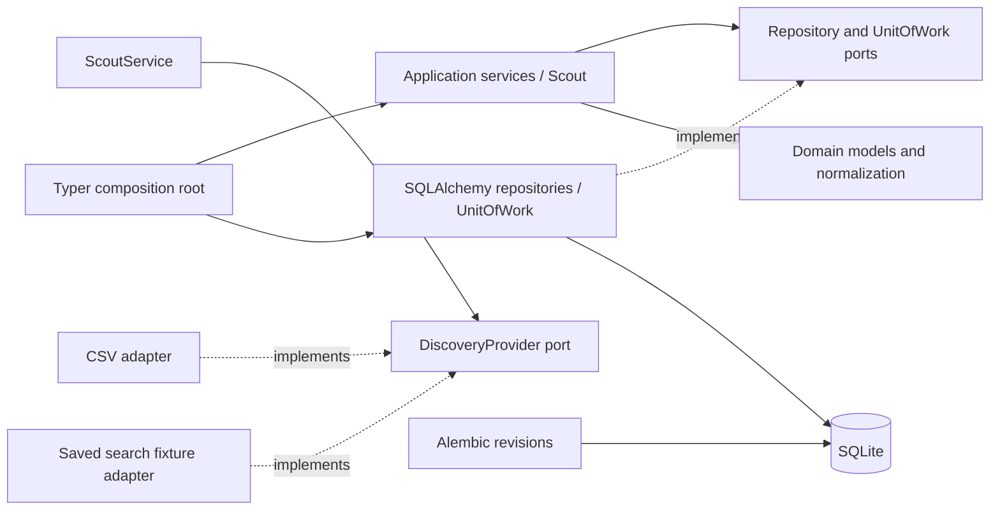
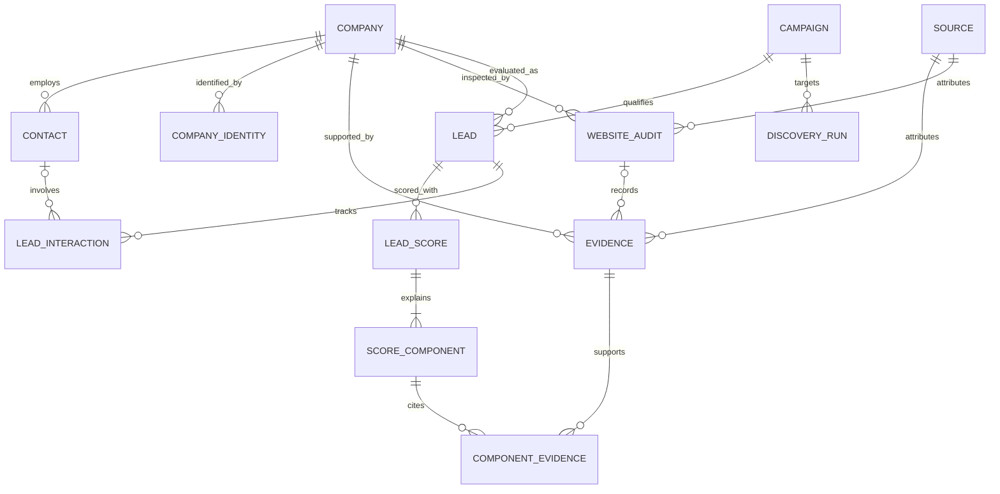
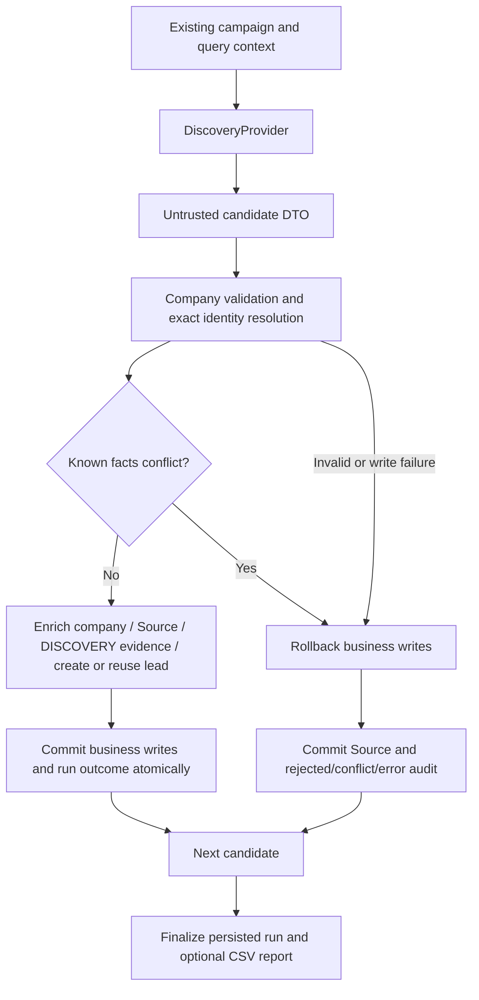
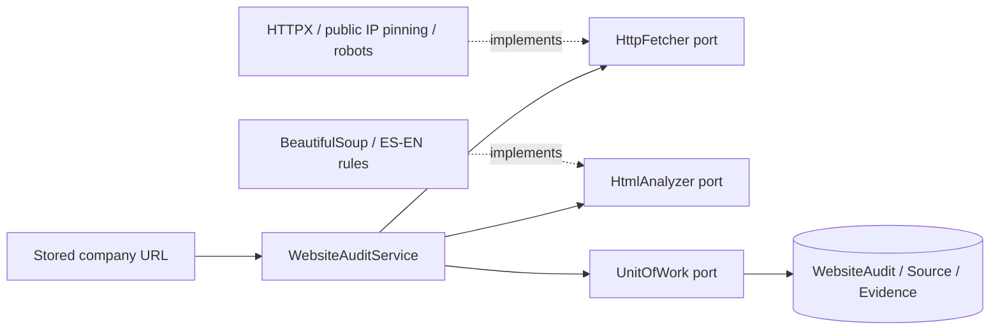
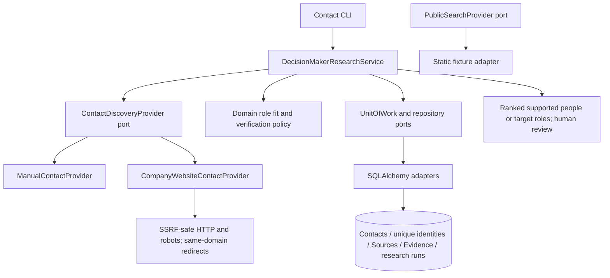
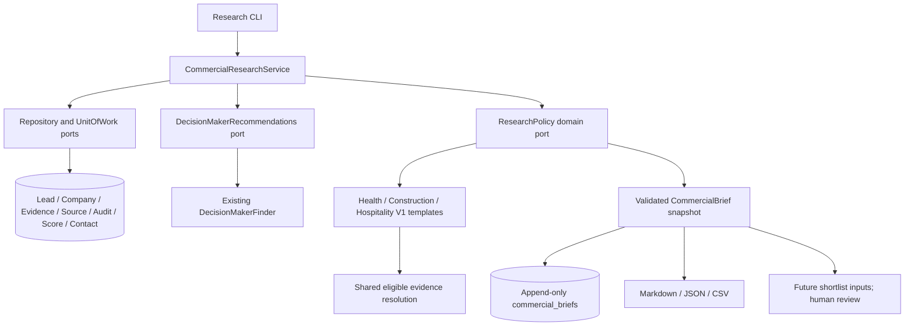
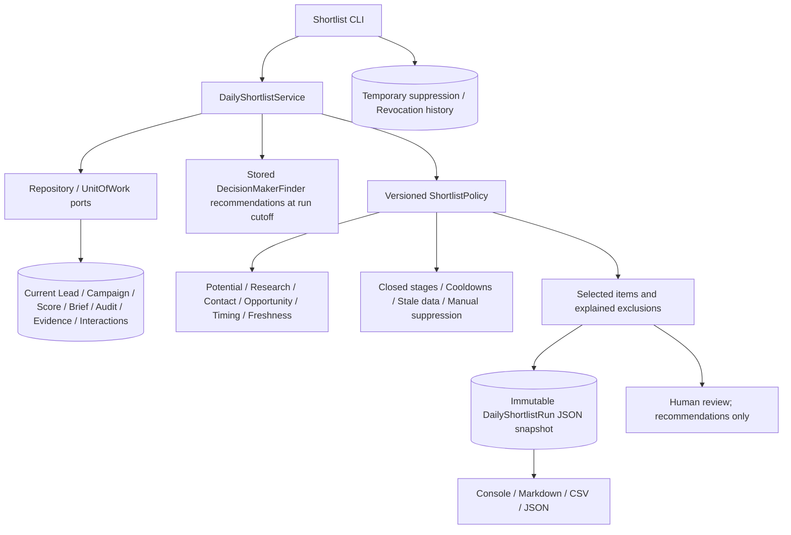

# Architecture

Build an organization with explicit responsibilities and evidence. There is no agent runtime or
orchestration framework. Domain models validate local invariants; application services validate
relationships and identity; infrastructure implements storage; CLI composes dependencies.

## Domain schema

Tables: `companies`, `contacts`, `sources`, `evidence`, `campaigns`, `leads`, `lead_scores`,
`score_components`, `lead_interactions`, plus `company_identities` and `component_evidence`.
Revision `0002` adds `discovery_runs`; `0003` adds `website_audits` and optional evidence audit links.
Alembic manages `alembic_version`. All entity IDs are UUIDs.
No separate pipeline table exists: `PipelineStage` aliases `LeadStatus` to avoid conflicting states.

## Evidence and qualification

Each evidence record requires a company, source, statement, category, confidence and observation time.
Source retrieval and evidence observation times are distinct. URLs are normalized public HTTP(S)
URLs without credentials/fragments. Manual sources can omit a URL. Source metadata and raw values
are JSON; component evidence references are relational foreign keys. Company/contact creation does
not itself establish a conclusion or designate a decision maker.

Scores are immutable historical aggregates. Decimal points, unique criteria, positive maximums,
maximum total of exactly 100, and sum of awards equal to total make each stored score reproducible.
Version and explanations identify the evaluation context. The service rejects evidence from another
company. Scoring rules and campaign weights are outside this task.

## Identity

`application.identity` exposes signal generation and duplicate resolution. It uses exact normalized
domain, then legal name/locality, then canonical name/locality. Name normalization preserves original
record names while comparing case, accents, punctuation and whitespace consistently. Location needs
city and country. Name keys are SHA-256 of normalized inputs; domain keys retain the normalized host.

`company_identities.key` is unique. Different signals resolving to different companies or a name
match with conflicting domains cause an explicit error. A matching company's known values are
preserved; missing details are enriched. UUID lookup supports already-known provisional records.
Without enough signals, automatic name matching is unsafe and new records remain provisional.
Shared domains/branches and conflicting facts require future human review; no fuzzy merge occurs.

## Persistence boundaries

`LeadService` runs against repository/unit-of-work protocols. Its caller owns an explicit transaction;
SQLAlchemyUnitOfWork flushes writes, commits on request and rolls back on uncommitted exit or failure.
Repositories map records but contain no qualification/scoring policies. SQL constraints supplement
application checks: identity and company/campaign uniqueness, foreign keys, enums and scalar bounds.
Cross-company relationships and cross-row score totals are validated by the application/domain;
writing raw SQL bypasses these guarantees and is not a supported business write path.

Alembic revision `0001` creates the schema from an empty database. CLI init uses the same migrations
as direct Alembic. Tests compare migrated schema to ORM metadata, round-trip records and exercise
upgrade/downgrade. No `create_all` shortcut or production deployment is used.

SQLite connections enable foreign keys. UTC timestamps round-trip safely through SQLite's timezone
limitations. SQLAlchemy mappings support a later PostgreSQL migration, subject to driver setup and
backend tests. Local reset is deliberately restricted and requires confirmation; keep clients closed.

## Lifecycle and future responsibilities

LeadStatus covers DISCOVERED, QUALIFYING, QUALIFIED, REJECTED, READY_FOR_RESEARCH,
READY_FOR_OUTREACH, CONTACTED, RESPONDED, MEETING, PROPOSAL, WON, LOST and ARCHIVED.
This task models states, not transition policy. Interactions track human actions without sending
communications or automatically changing status. READY_FOR_OUTREACH is not proof of human approval;
a future outreach workflow must introduce and enforce its explicit approval gate.

| Capability | Input | Output | Evidence obligation |
| --- | --- | --- | --- |
| Scout V1 (CSV/demo) | Query, campaign, provider | Companies, leads, run audit | Source and observation provenance |
| WebsiteAuditor V1 | Configured homepage URL | Persisted audit and objective findings | Source/audit links, timestamps and matched signals |
| CommercialScorer V1 | Lead, campaign, evidence, contacts, audits | Versioned score/components and readiness | Rule explanations and evidence IDs |
| DecisionMakerFinder | Company and public source ports | Possible people/roles | Public sources and confidence |
| ResearchAnalyst | Findings and contacts | Outreach intelligence | Attributed claims and uncertainty |
| OutreachWriter | Human-approved intelligence | Draft | Claim references and approval record |
| PipelineManager | Human actions and stage changes | Pipeline history | Actor, timestamps and outcomes |

A future shortlist use case selects from scores/pipeline records and retains the evidence explaining
selection. Live web discovery, crawling, external APIs, AI inference, automatic outreach, LinkedIn automation
and final user interfaces remain outside this task. CSV and fixture discovery are now implemented.

## Scout capability

Scout accepts provider-neutral DiscoveryQuery/DiscoveryCandidate DTOs. Query fields include campaign,
country, locality, industry, text and a bounded limit. All candidate facts may be unknown except a
usable company name at validation time. Context does not invent candidate locality. The CSV adapter
reads UTF-8 headers and preserves original cells/line numbers. StaticDiscoveryProvider consumes local
fixtures; it never fetches HTTP, scrapes search pages or filters by implied search relevance.

Scout uses existing repository and UnitOfWork ports. One transaction handles a candidate's company,
identity keys, lead, source, evidence and accepted audit result. Identity matches enrich missing facts;
known differing facts cause a reported conflict and no partial enrichment. Successful observations
always get new provenance, while companies and company/campaign leads are reused. No score is produced.

DiscoveryRun is a persisted aggregate with JSON query/outcomes and derived counters. Audit JSON
references sources/company/lead IDs; business evidence remains relational with mandatory source FKs.
Outcome updates commit with business writes. Rejection/conflict/error sources and outcomes commit in
a fresh transaction after rollback. Source metadata namespaces untrusted provider metadata below
`provider_metadata` and keeps authoritative run references separate. Invalid provenance URLs are kept
only as raw candidate data in fallback sources. Source/evidence record receipt, not verification.

Migration `0002` adds a campaign-indexed discovery_runs table without rewriting `0001` or its data.
Tests cover empty-database migration, upgrade from populated `0001`, downgrade and ORM equivalence.
Provider failure finishes a FAILED run; abrupt process termination may leave RUNNING for manual
inspection. There is no scheduler/resume/retry orchestration. CLI run/report commands expose the
persisted audit trail and counts; reports never overwrite existing files.

All discovery tests are local fixtures and temporary SQLite. No network client dependency is added.

## WebsiteAuditor V1

HTTP and parser objects never cross into application/domain logic. AuditSettings centralizes timeout,
size/redirect limits, pacing, slow-response threshold and freshness. V1 retrieves the configured
homepage URL, robots.txt and at most 3 guarded redirects; discovered links are only observed in
markup, never visited. There is no scoring, subjective design assessment or JavaScript execution.

Reachability/status, HTTPS/redirects and timing are transport observations. HTML findings record
structure or exact ES/EN keyword/host signatures. Address/hours heuristics include lower confidence;
higher-level path findings enumerate the observed base signals. Missing markup is not a problem.
HTTP errors, access challenges, robots blocks and no stored URL are auditable outcomes rather than
invented weaknesses. Non-HTML/unparseable markup yields PARTIAL with warnings.

The production HTTP transport resolves all DNS addresses, rejects non-public/mixed destinations
and pins the connection to a checked literal IP with original Host/TLS SNI and certificate validation.
No shared TLS connections, environment proxies, credentials or cookies are used. Every redirect and
robots request uses the same checks. Robots restrictions, longer delays/rates and access failures are
not bypassed. Identity encoding avoids decompression expansion; body/redirect budgets constrain work.
The total budget is checked between operations/chunks; OS DNS and current socket operation timeouts
can extend wall-clock duration. No network is required in automated tests.

Network work happens before opening the write transaction. Source, WebsiteAudit and its Evidence
commit atomically. Evidence.website_audit_id is nullable for historical/scout evidence. The application
requires audit evidence to match the audit's company/source. Migration `0003` adds the nullable SQLite
REFERENCES column in place, preserving existing evidence and score associations without recreating
referenced tables. PostgreSQL uses named foreign-key operations; backend validation remains future work.

Fresh SUCCESS records for the same company/URL within 7 days are reused; --force bypasses only this
cache. Sequential campaign mode skips no-URL companies, deduplicates companies and limits newly
attempted audits. PARTIAL/FAILED/NO_WEBSITE remain eligible on later runs. No scheduling or automated
outreach is introduced. CLI composition provides real HTTPX, while tests/acceptance inject transport
fixtures without weakening the production URL policy.

## CommercialScorer V1

CommercialScoringService builds an immutable ScoringContext through repository/UnitOfWork ports.
CampaignScoringPolicy is a domain protocol; immutable V1Policy/rules hold all weights and thresholds.
Built-ins are health-v1, construction-v1 and hospitality-v1, each totaling 100. Domain policy code
has no application/infrastructure imports and performs no HTTP, scraping, AI or subjective evaluation.

Commercial evidence has an enum and strict structured-value validation. Manual observations retain
Source IDs and timestamps. DECISION_MAKER_ACCESS must cite an existing company contact and explicit
authority/access booleans; contact presence/name alone proves nothing. Existing LeadService validates
these invariants for all commercial writes, not just CLI calls.

Observations resolve within versioned age/confidence windows and the score's timestamp cutoff.
UNKNOWN never implies ABSENT. Contradictory values require a strictly newer equally/higher-confidence
observation; otherwise the subrule is uncertain and withheld. Each explanation cites considered
observations. Opportunity rules also require an observed commercial anchor. Website negatives require
explicit manual booleans or successful audit coverage; failed/older positive-only audits cannot invent
absence. New audits emit WEBSITE_SIGNAL_COVERAGE without assigning business scores.

LeadScore/ScoreComponents already provide immutable append-only history and relational evidence
references. No schema migration is introduced. Structured explanation metadata retains band profile,
weighted readiness, selected audit and calculation cutoff; historical reads do not recompute scores.
Scoring and component inserts commit atomically, and scoring never changes pipeline states/priority.
Campaign --min-score is a presentation filter after scoring all leads. Future versions can be registered
without replacing historical policies/scores. The policy tables and detailed semantics are documented
in scoring.md; readiness measures known rule-weight coverage and never rescales awarded points.

## DecisionMakerFinder V1

Providers return untrusted typed candidates; application validates company identity and writes
source-backed immutable observation history atomically. Recommendations resolve current roles from
supported observations, expose freshness/conflict warnings, and calculate contact fit independently
of LeadScore. Domain policy remains provider-independent. Migration 0004 is additive; existing
Contact and score schemas remain intact. No new orchestration or outbound messaging is introduced.
See contact-research.md for exact thresholds, role mappings and adapter limits.

## Commercial Research Analyst V1

Research reads stored inputs and appends one immutable Source-backed brief per generation. It does
not call network providers, generate scores, mutate pipeline state or send outreach. Domain policies
select evidenced opportunities, expose unknowns and compute independent research completeness.
Application validates identity/version/score/provenance before committing; infrastructure stores
indexed relational headers and a typed JSON snapshot. Migration 0005 is additive and portable.
Historical exports do not rerun rules. Full thresholds and templates are in research-analyst.md.

## Daily Shortlist V1

Shortlist policy reads current pipeline and interactions instead of trusting archived brief state.
Ranking is separate from LeadScore and does not mutate scores, briefs, contacts or pipeline. One
aware cutoff, explicit configuration, stable tie-breaks and snapshot history make runs reproducible.
Migration 0006 adds two portable tables; suppression revocation is the only new targeted repository
write besides inserts. No outbound execution, live discovery or scheduler is introduced. Detailed
rules and public-channel evidence requirements are documented in daily-shortlist.md.
