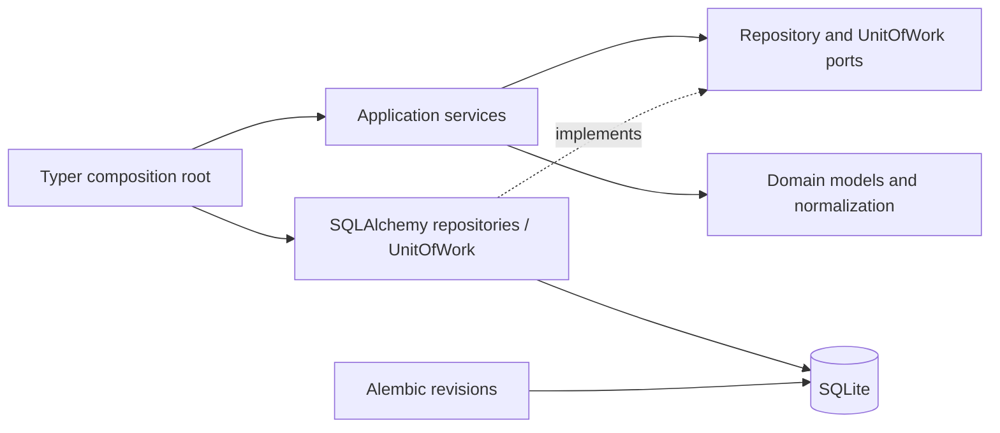
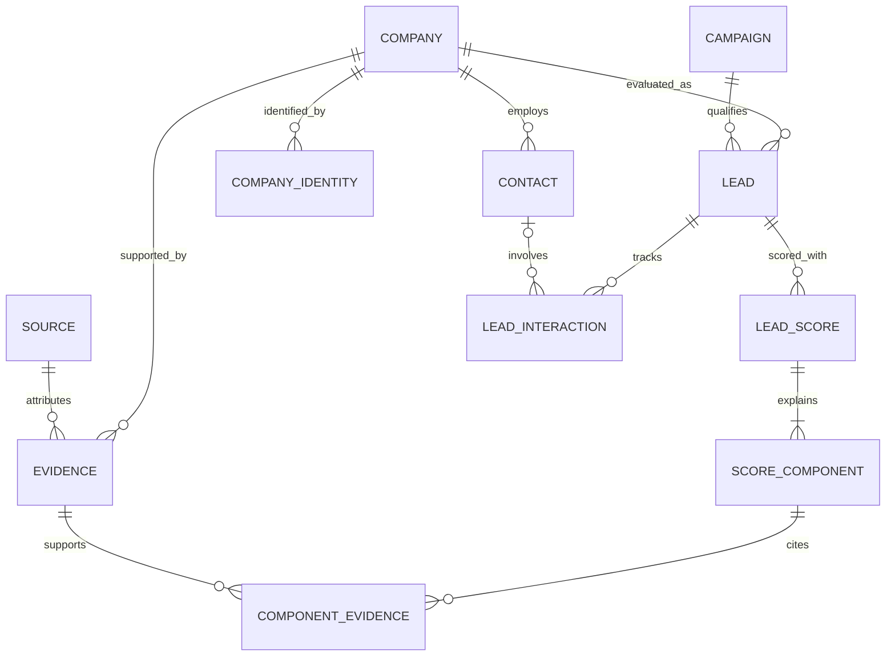

# Architecture

Build an organization with explicit responsibilities and evidence. There is no agent runtime or
orchestration framework. Domain models validate local invariants; application services validate
relationships and identity; infrastructure implements storage; CLI composes dependencies.

## Domain schema

Tables: `companies`, `contacts`, `sources`, `evidence`, `campaigns`, `leads`, `lead_scores`,
`score_components`, `lead_interactions`, plus `company_identities` and `component_evidence`.
Alembic manages an additional `alembic_version` table. All entity IDs are UUIDs.
No separate pipeline table exists: `PipelineStage` aliases `LeadStatus` to avoid conflicting states.

## Evidence and qualification

Each evidence record requires a company, source, statement, category, confidence and observation time.
Source retrieval and evidence observation times are distinct. URLs are normalized public HTTP(S)
URLs without credentials/fragments. Manual sources can omit a URL. Source metadata and raw values
are JSON; component evidence references are relational foreign keys. Company/contact creation does
not itself establish a conclusion or designate a decision maker.

Scores are immutable historical aggregates. Decimal points, unique criteria, positive maximums,
maximum total of exactly 100, and sum of awards equal to total make each stored score reproducible.
Version and explanations identify the evaluation context. The service rejects evidence from another
company. Scoring rules and campaign weights are outside this task.

## Identity

`application.identity` exposes signal generation and duplicate resolution. It uses exact normalized
domain, then legal name/locality, then canonical name/locality. Name normalization preserves original
record names while comparing case, accents, punctuation and whitespace consistently. Location needs
city and country. Name keys are SHA-256 of normalized inputs; domain keys retain the normalized host.

`company_identities.key` is unique. Different signals resolving to different companies or a name
match with conflicting domains cause an explicit error. A matching company's known values are
preserved; missing details are enriched. UUID lookup supports already-known provisional records.
Without enough signals, automatic name matching is unsafe and new records remain provisional.
Shared domains/branches and conflicting facts require future human review; no fuzzy merge occurs.

## Persistence boundaries

`LeadService` runs against repository/unit-of-work protocols. Its caller owns an explicit transaction;
SQLAlchemyUnitOfWork flushes writes, commits on request and rolls back on uncommitted exit or failure.
Repositories map records but contain no qualification/scoring policies. SQL constraints supplement
application checks: identity and company/campaign uniqueness, foreign keys, enums and scalar bounds.
Cross-company relationships and cross-row score totals are validated by the application/domain;
writing raw SQL bypasses these guarantees and is not a supported business write path.

Alembic revision `0001` creates the schema from an empty database. CLI init uses the same migrations
as direct Alembic. Tests compare migrated schema to ORM metadata, round-trip records and exercise
upgrade/downgrade. No `create_all` shortcut or production deployment is used.

SQLite connections enable foreign keys. UTC timestamps round-trip safely through SQLite's timezone
limitations. SQLAlchemy mappings support a later PostgreSQL migration, subject to driver setup and
backend tests. Local reset is deliberately restricted and requires confirmation; keep clients closed.

## Lifecycle and future responsibilities

LeadStatus covers DISCOVERED, QUALIFYING, QUALIFIED, REJECTED, READY_FOR_RESEARCH,
READY_FOR_OUTREACH, CONTACTED, RESPONDED, MEETING, PROPOSAL, WON, LOST and ARCHIVED.
This task models states, not transition policy. Interactions track human actions without sending
communications or automatically changing status. READY_FOR_OUTREACH is not proof of human approval;
a future outreach workflow must introduce and enforce its explicit approval gate.

| Future module | Input | Output | Evidence obligation |
| --- | --- | --- | --- |
| Scout | Industry, geography, source ports | Company candidates | Source and observation provenance |
| WebsiteAuditor | Company website | Structured findings | URLs, timestamps, observable signals |
| CommercialScorer | Company and findings | Versioned score/components | Rationale and evidence IDs |
| DecisionMakerFinder | Company and public source ports | Possible people/roles | Public sources and confidence |
| ResearchAnalyst | Findings and contacts | Outreach intelligence | Attributed claims and uncertainty |
| OutreachWriter | Human-approved intelligence | Draft | Claim references and approval record |
| PipelineManager | Human actions and stage changes | Pipeline history | Actor, timestamps and outcomes |

A future shortlist use case selects from scores/pipeline records and retains the evidence explaining
selection. Discovery, crawling, external APIs, AI inference, automatic outreach, LinkedIn automation
and final user interfaces remain outside this task.
