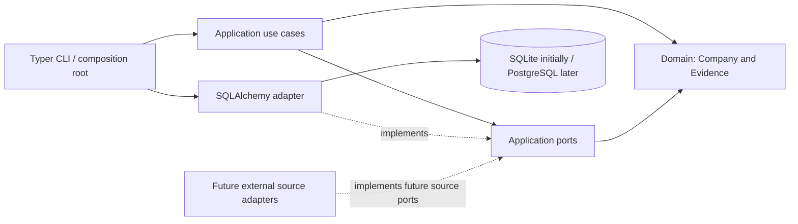

# Architecture

Dependencies point inward. Domain has no application, SQLAlchemy or CLI imports.
Application uses typed ports; infrastructure implements them. CLI is the composition root.
There is no orchestration framework or agent runtime in this foundation.

## Future responsibility contracts

These are design placeholders, not implemented agents. Add executable interfaces when the
first use case needs them; avoid speculative models and method signatures.

| Module | Input | Output | Required evidence |
| --- | --- | --- | --- |
| Scout | Industry, geography, source ports | Company candidates | Source URL, observation time, source identity |
| WebsiteAuditor | Company website | Structured findings | URL, time, observed signals |
| CommercialScorer | Company and audit findings | Score 0–100 and rationale | Linked findings and scoring version |
| DecisionMakerFinder | Company and public source ports | Possible decision makers | Public source URLs, time, confidence |
| ResearchAnalyst | Company, findings, people | Outreach intelligence | Attributed claims and uncertainty |
| OutreachWriter | Approved intelligence and channel | Draft outreach | Claim references and approval state |
| PipelineManager | Human-approved stage transition | Pipeline record | Actor, timestamp, transition history |

A later shortlist use case will select high-value leads from persisted scores and pipeline state.
It must retain the evidence and scoring version that explain each selection.

## Persistence and identity

The current database adapter only probes connectivity. `CompanyRepository` defines lookup by
canonical identity and insertion; insertion must reject duplicates rather than overwrite them.
Future persistence needs a unique database constraint and a domain-level duplicate error.
Identity resolution must account for companies sharing domains and branches; uncertain matches
require explicit review. Domain names alone are not a universal company identifier.

Store companies, sources and attributed observations separately when implementing persistence.
Use portable SQLAlchemy models, transactions and migrations, with SQLite integration tests.
PostgreSQL requires a driver and backend verification; changing a URL is not a complete migration.

## Operational limits

The bootstrap performs no network research or outreach. External providers will live behind
ports. No automated LinkedIn scraping, invitations or messages are allowed. Email and WhatsApp
must not be sent automatically; a human approval gate remains required before outreach.
